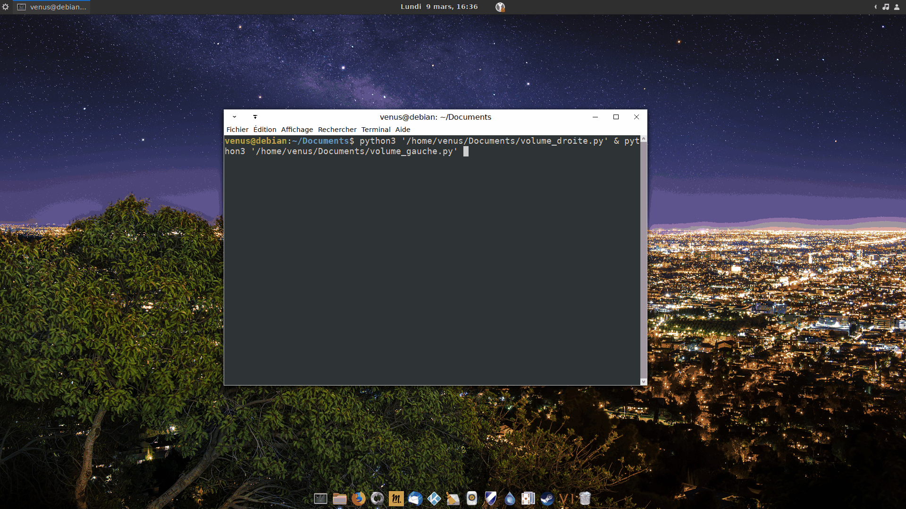

# volumouse
A Python 3 program that allows you to change the volume with the mouse wheel using it at the four corners of the screen

                                
<!---
THIS TAG DOESN'T WORK, DON'T TRUST IT : 
-->

IF YOU LIKE THIS PROGRAM, PLEASE GIVE ME A STAR :star:

# Download the folder and extract it : 

[Download :inbox_tray:](https://github.com/pzim-devdata/volumouse/releases/latest/download/volumouse.zip)

[![no blinking/flickering TextProgressBar][2]][2]

  [2]: https://i.stack.imgur.com/mMy7Y.gif
  
# Install dependancies :

- You will need x11-utils :
Debian, Ubuntu, Kali Linux, Raspbian :`apt-get install x11-utils`
Arch Linux :`pacman -S xorg-xdpyinfo`
CentOS : `yum install xorg-x11-utils`
Fedora : ~~`dnf install xorg-x11-utils`~~ `dnf install python3-xlib`

- You will also need pulseaudio-utils :
Debian, Ubuntu, Kali Linux, Raspbian : `apt-get install pulseaudio-utils`
Alpine : `apk add pulseaudio-utils`
Arch Linux : `pacman -S libpulse`
CentOS : `yum install pulseaudio-utils`
Fedora : `dnf install pulseaudio-utils`

# Start the app :

Run in your imported folder : 

- ~~`python3 -m pip install -r requirements.txt` in order to install dependencies~~

~~and~~

- `python3 volumouse.py` for being sure that volumouse starts

# Configure :

It's very easy to configure, there is just a simple command to execute, once for all, the first time :

All is explained in `python3 'volumouse.py' --help` and `python3 'volumouse.py' --info`

Open a terminal in the directory of volumouse.py and type :

- `python3 'volumouse.py' --configure` in the imported folder 
or 
- `python3 '/place/of/the/folder/volumouse/volumouse.py' -c`

# Usage : 

Just run the command `python3 'volumouse.py'` in the imported folder or `python3 '/place/of/the/folder/volumouse/volumouse.py'`

For working, you should add `python3 '/place/of/the/folder/volumouse/volumouse.py'` to the starting apps during the system's startup.

Enjoy !

[@pzim-devdata GitHub Pages](https://github.com/pzim-devdata/volumouse/issues)

     

     

------------------------------------------------------------------

- [Licence](https://github.com/pzim-devdata/DATA-developer/raw/master/LICENSE)
MIT License Copyright (c) 2023 pzim-devdata

------------------------------------------------------------------

Created by @pzim-devdata - feel free to contact me!

